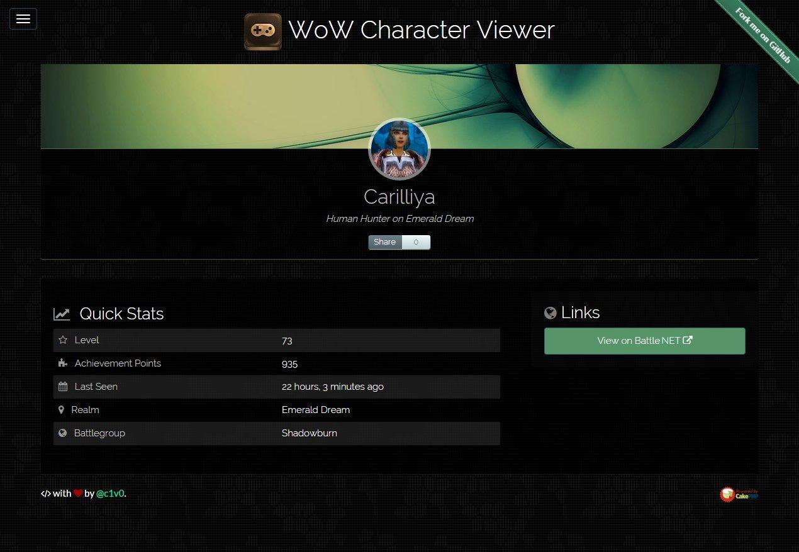

# WOWCHAR.info

 WOWCHAR.info is a demo CakePHP application that loads character data from the World of Warcraft web API. Including a character URL in a Facebook or Twitter comment generates a fancy in-app link preview using character art and stats.

View live:

* Home page @ [wowchar.info](http://wowchar.info).
* Character page @ [wowchar.info/s?character=Carilliya&realm=emerald-dream](http://wowchar.info/s?character=Carilliya&realm=emerald-dream).

### Requirements

Requires `PHP 5.4+`, `CakePHP 2.x`. Uses `Jekyll` and `Bower` for package management. Also uses CakePHP's [HttpSocket()](http://book.cakephp.org/2.0/en/core-utility-libraries/httpsocket.html) class for the request to the Battle.NET web API.

### Screenshot

### License

MIT

### Built with

	
	
	
	
	

