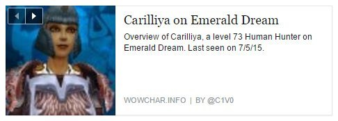

 An experimental CakePHP application that uses the World of Warcraft web API to allow users to search for and share character details. Adds [graph objects](http://ogp.me) to help Facebook pull in character in the character details, as shown in the example.

## Requirements

Requires `PHP >= 5.4`, `CakePHP 2.x`, and `Bower`. Uses [HttpSocket()](http://book.cakephp.org/2.0/en/core-utility-libraries/httpsocket.html).

### License

MIT

___
  
