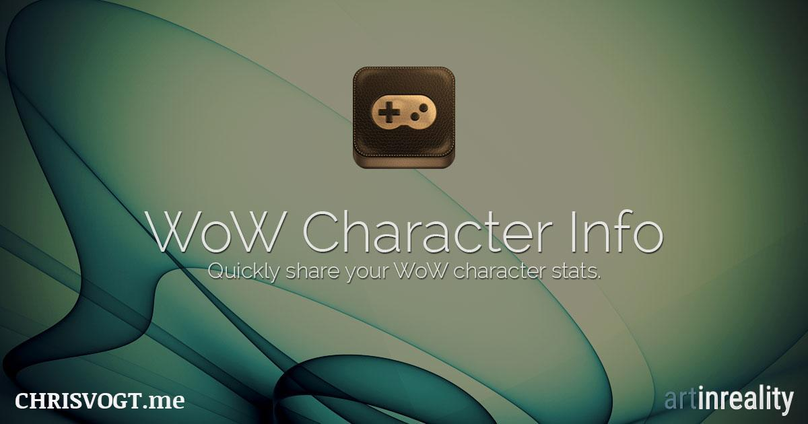

A CakePHP app that pulls basic character information from the World of Warcraft web API and generates character previews you can share and preview on social networking sites.

## Requirements

- PHP 5.4 and above.
- CakePHP 2.x
