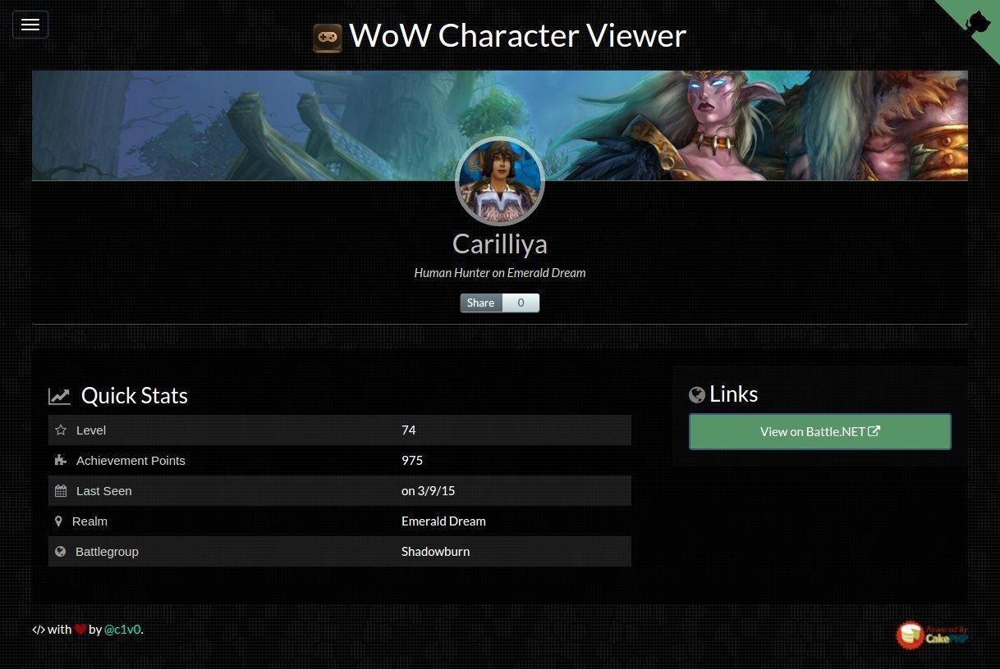

# WoW Character Stats

> WOWCHAR.info

Uses the [Battle.net API](https://dev.battle.net/) to lookup and render WoW character stats.

View live:

* Home page @ [wowchar.info](http://wowchar.info).
* Character page @ [wowchar.info/s?character=Carilliya&realm=emerald-dream](http://wowchar.info/s?character=Carilliya&realm=emerald-dream).

### Requirements

Requires `PHP 5.4+`, `composer`, and `npm`.

### Screenshot

### License

[MIT License](LICENSE)

### Built with

	
	
    
    
    
	
	

